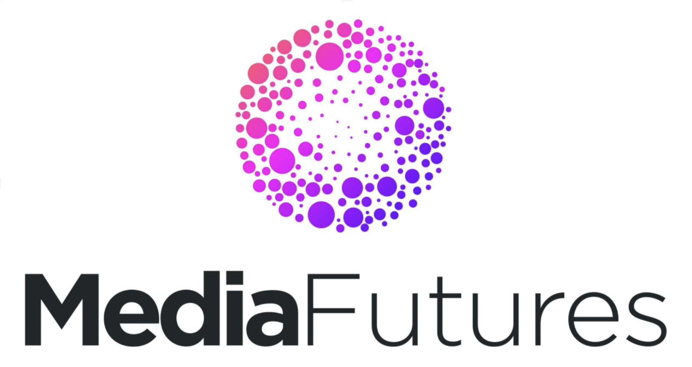

# Edit Wars - a media futures project website

## [editwars.org](https://editwars.org)

Edit Wars is a project using the analysis of media publications accompanying the growing militarization and manipulation of mass consciousness in Russia for a better understanding of the mechanics of state propaganda and ways to build resilience towards it. The project focus on the use of aggressive narratives in the government-controlled media that isolate public perception from the real state of affairs.

## Installation

```bash
# install dependencies
$ yarn install

# serve with hot reload at localhost:3000
$ yarn dev

```

## Status

[](https://app.netlify.com/sites/edit-wars/deploys)


## Edit Wars Team

- Slava Romanov, Media Artist, Team Lead
- Alberto Harres, Artist and Developer
- Antonio Hofmeister Ribeiro, Artist and Developer
- Lucy Saribegyan, Artist and Designer
- Maiia Guseva, Data Analyst
- Sofya Ozga, Artist and Researcher

## Funding

Edit Wars is a project using the analysis of media publications accompanying the growing militarization and manipulation of mass consciousness in Russia for a better understanding of the mechanics of state propaganda and ways to build resilience towards it. The project focus on the use of aggressive narratives in the government-controlled media that isolate public perception from the real state of affairs.

This website is part of a project «Edit Wars»‎ that has received funding from the European Union’s Horizon 2020 research and innovation programme (MediaFutures «‎Artist for media»‎) under grant agreement No.  951962



